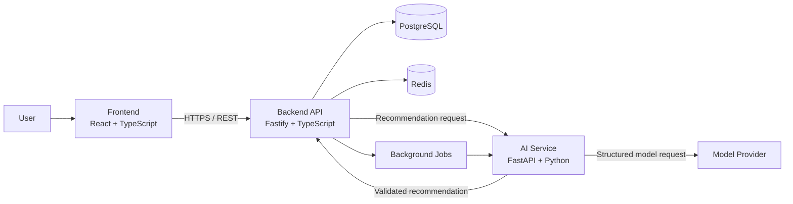

# Architecture

FitFlow uses a three-part application structure. The browser-facing frontend owns presentation and interaction, the backend owns product behavior and data access, and the AI service owns recommendation orchestration.

## System Diagram

## Responsibilities

### Frontend

- Renders onboarding, dashboard, workout, nutrition, and progress views.
- Manages local interaction state and calls the backend through the documented API.
- Presents loading, error, empty, and consent states explicitly.

### Backend

- Authenticates users and authorizes access to personal records.
- Validates requests, applies product rules, and persists domain data.
- Coordinates AI requests without exposing provider credentials to the browser.
- Records request identifiers and outcomes for observability.

### AI Service

- Builds prompts or model inputs from narrowly scoped backend context.
- Validates model output against a typed response schema.
- Applies safety and refusal handling before returning recommendations.
- Keeps provider-specific code behind an adapter interface.

## Request Flow

1. The user submits a goal or tracking update in the frontend.
2. The backend authenticates the request, validates the payload, and stores the user action.
3. For an AI-assisted feature, the backend sends only the required context to the AI service.
4. The AI service calls the configured model provider and validates the response.
5. The backend applies product constraints, stores the accepted result when appropriate, and returns a stable API response.
6. The frontend renders the result with a clear indication that AI guidance is advisory.

## Security and Reliability

- Use TLS for all deployed service-to-service and client-to-service traffic.
- Store secrets in the deployment secret manager, never in frontend configuration.
- Enforce authorization at the backend for every user-owned resource.
- Redact personal health data from logs and send only minimum necessary context to AI providers.
- Add timeouts, retries with bounds, rate limiting, and correlation IDs around AI calls.
- Treat model output as untrusted input and validate it before use or persistence.